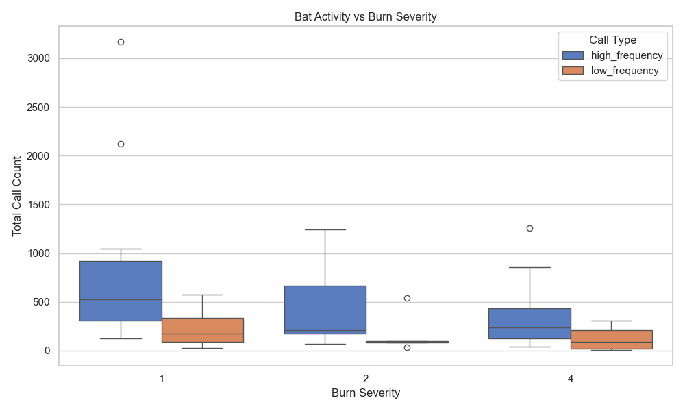

## Wildlife Response to Wildfire
### Study Background
The Rocky Mountain Research Center and the USDA are currently recording data on a study to determine the response to fire across species. They are studying three 2020 megafires in Colorado that burned over 230,000 hectares,
where they have sampled 134 burned and unburned locations over the last 1.5 years, with varying burn severity. 

  Study Site Locations
  
They performed acoustic monitoring of birds and bats for 3 weeks at each location. Acoustic recording units were place on 2 meter PVC pipes
and recorded birds for an hour before sunset and an hour after sunrise, and bats were recorded continuously from sunset to sunrise. Trail cameras were placed at each site to record non flying mammals. They aim to study the 
changes in occupancy and biodiversity with variations in fire variables (fire severity and pyrodiversity), topology/elevation, pre-fire vegetation, and drought mortality. Learning the patterns of post-fire occupancy can 
help inform how to best manage forests after wildfires to support wildlife.

Similar work has been done studying the relationship between pyrodiversity and bat occupancy, including the papers referenced below. It has been found that bats are impacted by fire severity, fire frequency, time since last burn, 
burn extent, season of burn, and pyrodiversity. There has been some evidence showing that species richness increases in pyrodiverse areas - potentially due to a greater accessibility of foraging habitats and increased 
habitat heterogeneity. Generally, bats show positive or neutral response to prescribed fire, and a negative, though sometimes short-lived, response to wildfire.

[The effects of wildfire severity and pyrodiversity on bat occupancy and diversity in fire-suppressed forests](https://www.nature.com/articles/s41598-019-52875-2)

[Bats and fire: a global review](https://research.fs.usda.gov/treesearch/63537)

### Project

In order to narrow down this project into something more manageable for my time frame I decided to pursue the question of: how do elevation and pyrodiversity influence bat presence and activity in areas 
affected by the 2020 East Troublesome fire? My goal was to be able to determine some summary statistics and rudimentary analysis on these relationships. 

The data provided by the RMRC included 27 sites within or just outside the boundary of the East Troublesome fire that had recorded bat data. 

  East Troublesome Fire Boundary
  
### Data Sources
My data sources included a site data csv that contained site information like longitude, latitude, and types of recordings pulled and a bat recording csv file containing site number, data, 
number of high and low frequency bats, and bat species recorded. Both of these csvs had a temporal range of May to August 2024 and were provided by the RMRC. Additionally, I used a shapefile from the MTBS burned
area boundary dataset, which is a shapefile containing the boundary of the East Troublesome fire. I also used SRTM elevation data which is a DEM with 30 arc sec resolution. 

### Methods

My methods began by downloading the MTBS boundary for the East Troublesome fire and creating a GeoPandas GeoDataFrame.

Next I merged the two csv files together and only kept the columns that I was interested in, which was the site, latitude, longitude, bats recorded, and the fire severity. Bat recordings were separated into 'hi_pass' and 'lo_pass', which are simply the number of high frequency recordings and low frequency recordings caught by the audio equipment. These recordings are run through AI to determine the exact bat species - which few of the auto recordings are high enough quality to get an actual species identification from. The possible high frequency bat species include: Myyu, Myca, Myci, Myvo, Mylu, Pahe The possible low frequency bat species include: Anpa, Epfu, Lano, Coto, Myth, Tabr, Laci, Euma. However bats have a range of frequency and some have a range that include both high and low frequencies. The fire severity data is categorical data from 1 to 4, 1 being unburned and 4 being severly burned. I also made general formatting adjustments for workability of the DataFrame.

Finally, I graphed the number of bat calls against the fire severity value and fit a Negative Binomial GLM to predict the bat activity based on fire severity.
  
### Results
I discovered that there was possibly a small negative relationship between bat activity and fire severity. All of my p values are greater than 0.05 so I haven't found anything statistically significant, and my R values are low as well, probably due to limited study sites and other factors occurring. 

In the future I plan to add in elevation and pyrodiversity. I also want to georeference my csv so that I can visualize my data spatially. It is also of note that I am using bat activity instead of bat occupancy, and I am considering doing a occupancy model and diving into more specific bat species present. 

  Box Plot of Bat Activity Versus Fire Severity
  
  
  Negative Binomial GLM High Frequency Predictions
 
  
  Negative Binomial GLM High Frequency Predictions Table
  
  
  Negative Binomial GLM Low Frequency Predictions

  
  Negative Binomial GLM Low Frequency Predictions Table
